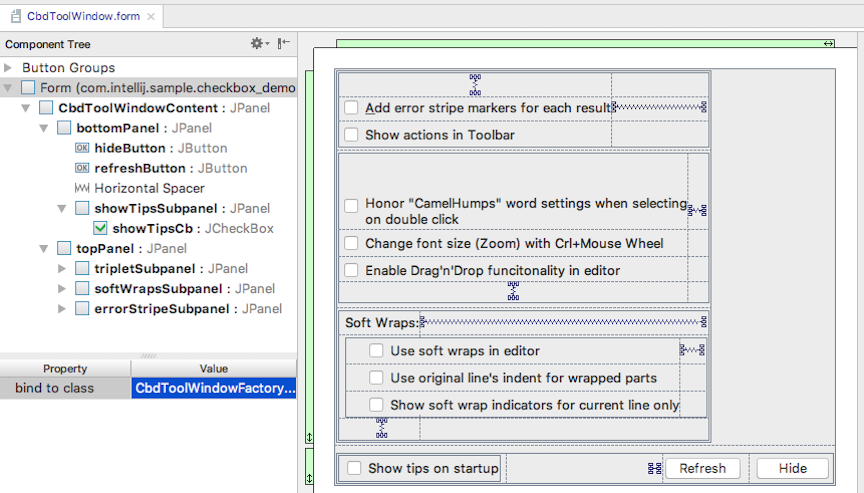
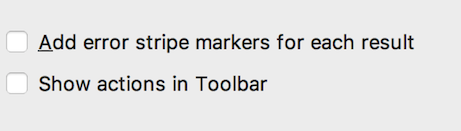
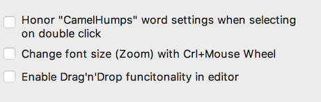
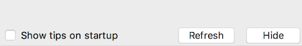

-----------------------------------------------
Checkboxes
-----------------------------------------------

### Definition of the Checkbox Tool Window
The IntelliJ IDEA Form Editor renders this view from the XML contents of the `CbdToolWindow.form` file.


<br>
<br>

Below is the XML file header and definition of parent window written to the `CbdToolWindow.form` file.
```xml
<?xml version="1.0" encoding="UTF-8"?>
<form xmlns="http://www.intellij.com/uidesigner/form/" version="1" bind-to-class="com.intellij.sample.checkbox_demo.CbdToolWindowFactory">
  <grid id="27dc6" binding="CbdToolWindowContent" layout-manager="GridLayoutManager" row-count="2" column-count="1" same-size-horizontally="false" same-size-vertically="false" hgap="-1" vgap="-1">
    <margin top="0" left="0" bottom="0" right="0"/>
    <constraints>
      <xy x="20" y="20" width="500" height="416"/>
    </constraints>
    <properties/>
    <border type="none"/>
    <children>
    <!--
      Java Swing Components within Checkbox Tool Window...
    -->
    </children>
  </grid>
</form>
```
<br>
Below is the simplified `CbdToolWindowFactory` class definition, which extends `ToolWindowFactory`. For the complete
implementation, see `CbdToolWindowFactory.java`

```java
package com.intellij.sample.checkbox_demo;
public class CbdToolWindowFactory implements ToolWindowFactory {

  private JPanel CbdToolWindowContent;
  private ToolWindow CbdToolWindow;

  public CbdToolWindowFactory() {
    // Add ActionListeners to buttons and checkboxes...  
  }

  // Create the tool window content - called by framework
  public void createToolWindowContent(Project project, ToolWindow toolWindow) {
    CbdToolWindow = toolWindow;
    this.resetPanel();
    ContentFactory contentFactory = ContentFactory.SERVICE.getInstance();
    Content content = contentFactory.createContent(CbdToolWindowContent, "", false);
    toolWindow.getContentManager().addContent(content);
  }

  // Example ActionListener
  public class genericCheckboxListener implements ActionListener {
    @Override
    public void actionPerformed(ActionEvent e) {
      // Take action based on the ActionEvent...
    }
  }
}
```

### Example 1 - Java Swing Checkboxes with Underline in Text



Below is the XML declaring the panel, grid, and spacing as well as the checkboxes in the `CbdToolWindow.form` file. Note the text for the first button contains 
an explicit underline for the first letter of the checkbox text.

```xml
<grid id="888ca" binding="topPanel" layout-manager="GridLayoutManager" row-count="3" column-count="1" same-size-horizontally="false" same-size-vertically="false" hgap="-1" vgap="-1">
    <margin top="0" left="0" bottom="0" right="0"/>
    <constraints>
      <grid row="0" column="0" row-span="1" col-span="1" vsize-policy="3" hsize-policy="3" anchor="8" fill="2" indent="0" use-parent-layout="false"/>
    </constraints>
    <properties/>
    <border type="none"/>
    <children>
      <grid id="8a7a7" binding="errorStripeSubpanel" layout-manager="GridLayoutManager" row-count="3" column-count="2" same-size-horizontally="false" same-size-vertically="false" hgap="-1" vgap="-1">
        <margin top="0" left="0" bottom="0" right="0"/>
        <constraints>
          <grid row="0" column="0" row-span="1" col-span="1" vsize-policy="3" hsize-policy="3" anchor="0" fill="3" indent="0" use-parent-layout="false"/>
        </constraints>
        <properties/>
        <border type="none"/>
        <children>
          <!-- Declaration of Checkbox -->
          <component id="20525" class="javax.swing.JCheckBox" binding="addErrorStripeMarkersCb">
            <constraints>
              <grid row="1" column="0" row-span="1" col-span="1" vsize-policy="0" hsize-policy="3" anchor="8" fill="0" indent="0" use-parent-layout="false"/>
            </constraints>
            <properties>
              <text value="&lt;html&gt;&lt;u&gt;A&lt;/u&gt;dd error stripe markers for each result&lt;html&gt;"/>
            </properties>
          </component>
          <hspacer id="6efed">
            <constraints>
              <grid row="1" column="1" row-span="1" col-span="1" vsize-policy="1" hsize-policy="6" anchor="0" fill="1" indent="0" use-parent-layout="false"/>
            </constraints>
          </hspacer>
          <!-- Declaration of Checkbox -->
          <component id="832d" class="javax.swing.JCheckBox" binding="showActionsInToolbarCb">
            <constraints>
              <grid row="2" column="0" row-span="1" col-span="1" vsize-policy="0" hsize-policy="3" anchor="8" fill="0" indent="0" use-parent-layout="false"/>
            </constraints>
            <properties>
              <text value="&lt;html&gt;Show actions in Toolbar&lt;html&gt;"/>
            </properties>
          </component>
          <vspacer id="dc580">
            <constraints>
              <grid row="0" column="0" row-span="1" col-span="1" vsize-policy="6" hsize-policy="1" anchor="0" fill="2" indent="0" use-parent-layout="false"/>
            </constraints>
          </vspacer>
        </children>
      </grid>
    </children>
</grid>
```

### Example 2 - Java Swing Checkboxes with Wrapped Text


<br>
<br>
For brevity the `CbdToolWindow.form` XML defining the panel, grid, and spacing has been omitted from the example below. Note the text value for
the first checkbox has an explicit line break. Also note the first checkbox has styled tool tip text.

```xml
<children>
  <!-- Declaration of Checkbox -->
  <component id="73e73" class="javax.swing.JCheckBox" binding="camelHumpsCb">
    <constraints>
      <grid row="0" column="0" row-span="1" col-span="1" vsize-policy="0" hsize-policy="3" anchor="8" fill="0" indent="0" use-parent-layout="false"/>
    </constraints>
    <properties>
      <text value="&lt;html&gt;Honor &quot;CamelHumps&quot; word settings when selecting&lt;br&gt;on double click&lt;html&gt;"/>
      <toolTipText value="&lt;html&gt;&lt;i&gt;Honor CamelHumps Settings&lt;/i&gt;&lt;html&gt;"/>
      <verticalAlignment value="0"/>
      <verticalTextPosition value="1"/>
    </properties>
  </component>
  <!-- Declaration of Checkbox -->
  <component id="d7d4b" class="javax.swing.JCheckBox" binding="changeFontSizeZoomCheckBox" default-binding="true">
    <constraints>
      <grid row="1" column="0" row-span="1" col-span="1" vsize-policy="0" hsize-policy="3" anchor="8" fill="0" indent="0" use-parent-layout="false"/>
    </constraints>
    <properties>
      <text value="Change font size (Zoom) with Crl+Mouse Wheel"/>
    </properties>
  </component>
  <!-- Declaration of Checkbox -->
  <component id="7208" class="javax.swing.JCheckBox" binding="enableDragNDropCheckBox" default-binding="true">
    <constraints>
      <grid row="2" column="0" row-span="1" col-span="1" vsize-policy="0" hsize-policy="3" anchor="8" fill="0" indent="0" use-parent-layout="false"/>
    </constraints>
    <properties>
      <text value="Enable Drag'n'Drop funcitonality in editor"/>
    </properties>
  </component>
</children>
```

### Example 3 - Java Swing Checkbox Alignment Under a Heading


<br>
<br>
To emphasize the alignment of checkboxes with a header, all the `CbdToolWindow.form` XML for the subpanel, grid, and spacing is shown.

```xml
  <grid id="b9831" binding="softWrapsSubpanel" layout-manager="GridLayoutManager" row-count="3" column-count="2" same-size-horizontally="false" same-size-vertically="false" hgap="-1" vgap="-1">
    <margin top="0" left="5" bottom="0" right="0"/>
    <constraints>
      <grid row="2" column="0" row-span="1" col-span="1" vsize-policy="3" hsize-policy="3" anchor="0" fill="3" indent="0" use-parent-layout="false"/>
    </constraints>
    <properties/>
    <border type="none"/>
    <children>
      <!-- Declaration of Label -->
      <component id="b7f7" class="javax.swing.JLabel" binding="softWrapLabel">
        <constraints>
          <grid row="0" column="0" row-span="1" col-span="1" vsize-policy="0" hsize-policy="0" anchor="8" fill="0" indent="0" use-parent-layout="false"/>
        </constraints>
        <properties>
          <text value="Soft Wraps:"/>
          <verticalAlignment value="1"/>
        </properties>
      </component>
      <hspacer id="dfed4">
        <constraints>
          <grid row="0" column="1" row-span="1" col-span="1" vsize-policy="1" hsize-policy="6" anchor="0" fill="1" indent="0" use-parent-layout="false"/>
        </constraints>
      </hspacer>
      <vspacer id="a2fe">
        <constraints>
          <grid row="2" column="0" row-span="1" col-span="1" vsize-policy="6" hsize-policy="1" anchor="0" fill="2" indent="0" use-parent-layout="false"/>
        </constraints>
      </vspacer>
      <grid id="a499a" binding="softWrapCbdanel" layout-manager="GridLayoutManager" row-count="3" column-count="2" same-size-horizontally="false" same-size-vertically="false" hgap="-1" vgap="-1">
        <margin top="0" left="18" bottom="0" right="0"/>
        <constraints>
          <grid row="1" column="0" row-span="1" col-span="2" vsize-policy="3" hsize-policy="3" anchor="0" fill="3" indent="0" use-parent-layout="false"/>
        </constraints>
        <properties/>
        <border type="none"/>
        <children>
          <!-- Declaration of Checkbox -->
          <component id="3fcff" class="javax.swing.JCheckBox" binding="useSoftWrapsCb">
            <constraints>
              <grid row="0" column="0" row-span="1" col-span="1" vsize-policy="0" hsize-policy="3" anchor="8" fill="0" indent="0" use-parent-layout="false"/>
            </constraints>
            <properties>
              <text value="Use soft wraps in editor"/>
            </properties>
          </component>
          <hspacer id="ec237">
            <constraints>
              <grid row="0" column="1" row-span="1" col-span="1" vsize-policy="1" hsize-policy="6" anchor="0" fill="1" indent="0" use-parent-layout="false"/>
            </constraints>
          </hspacer>
          <!-- Declaration of Checkbox -->
          <component id="74ad5" class="javax.swing.JCheckBox" binding="useOriginalLineIndentCb">
            <constraints>
              <grid row="1" column="0" row-span="1" col-span="1" vsize-policy="0" hsize-policy="3" anchor="8" fill="0" indent="0" use-parent-layout="false"/>
            </constraints>
            <properties>
              <text value="Use original line's indent for wrapped parts"/>
            </properties>
          </component>
          <!-- Declaration of Checkbox -->
          <component id="413e4" class="javax.swing.JCheckBox" binding="showSoftWrapIndicatorCb">
            <constraints>
              <grid row="2" column="0" row-span="1" col-span="1" vsize-policy="0" hsize-policy="3" anchor="8" fill="0" indent="0" use-parent-layout="false"/>
            </constraints>
            <properties>
              <text value="Show soft wrap indicators for current line only"/>
            </properties>
          </component>
        </children>
      </grid>
    </children>
  </grid>  
```

### Example 4 - Java Swing Checkbox Alignment with Buttons

<br>
<br>
To emphasize the alignment of checkboxes with buttons, all the `CbdToolWindow.form` XML for the subpanel, grid, and spacing is shown.

```xml
  <grid id="7a4f2" binding="bottomPanel" layout-manager="GridLayoutManager" row-count="1" column-count="4" same-size-horizontally="false" same-size-vertically="false" hgap="-1" vgap="-1">
    <margin top="0" left="0" bottom="0" right="0"/>
    <constraints>
      <grid row="1" column="0" row-span="1" col-span="1" vsize-policy="3" hsize-policy="3" anchor="2" fill="1" indent="0" use-parent-layout="false"/>
    </constraints>
    <properties/>
    <border type="none"/>
    <children>
      <!-- Declaration of Button -->
      <component id="7eaa1" class="javax.swing.JButton" binding="hideButton" default-binding="true">
        <constraints>
          <grid row="0" column="3" row-span="1" col-span="1" vsize-policy="0" hsize-policy="3" anchor="0" fill="1" indent="0" use-parent-layout="false"/>
        </constraints>
        <properties>
          <text value="Hide"/>
        </properties>
      </component>
      <!-- Declaration of Button -->
      <component id="d1782" class="javax.swing.JButton" binding="refreshButton">
        <constraints>
          <grid row="0" column="2" row-span="1" col-span="1" vsize-policy="0" hsize-policy="3" anchor="0" fill="1" indent="0" use-parent-layout="false"/>
        </constraints>
        <properties>
          <text value="Refresh"/>
        </properties>
      </component>
      <hspacer id="8f7d4">
        <constraints>
          <grid row="0" column="1" row-span="1" col-span="1" vsize-policy="1" hsize-policy="6" anchor="4" fill="0" indent="0" use-parent-layout="false"/>
        </constraints>
      </hspacer>
      <grid id="6df" binding="showTipsSubpanel" layout-manager="GridLayoutManager" row-count="1" column-count="1" same-size-horizontally="false" same-size-vertically="false" hgap="-1" vgap="-1">
        <margin top="0" left="5" bottom="0" right="0"/>
        <constraints>
          <grid row="0" column="0" row-span="1" col-span="1" vsize-policy="3" hsize-policy="3" anchor="0" fill="3" indent="0" use-parent-layout="false"/>
        </constraints>
        <properties/>
        <border type="none"/>
        <children>
          <!-- Declaration of Checkbox -->
          <component id="39a98" class="javax.swing.JCheckBox" binding="showTipsCb">
            <constraints>
              <grid row="0" column="0" row-span="1" col-span="1" vsize-policy="0" hsize-policy="3" anchor="8" fill="0" indent="0" use-parent-layout="false"/>
            </constraints>
            <properties>
              <text value="Show tips on startup"/>
            </properties>
          </component>
        </children>
      </grid>
    </children>
  </grid>
```

